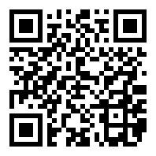

# TrebleShot Privacy Policy
This is the developer's policy which is created to give details and informs you if your personal information is collected, used, disclosed and secured by the developer. These policies are stated to ensure you know what personal details you may or may not disclose when the software is being utilized and the choices you have associated with that data. If you decide to continue using this software, it means you accept all terms and conditions stated by the developer in this policy. 

## Permission and Access

TrebleShot software requires some permissions to function effectively and efficiently. Without some of these permissions enabled, you might be unable to perform certain operations with the software.
TrebleShot requires the enablement of the following permissions;
- camera
- location
- storage
- telephone
The main permission required to get TrebleShot functioning is the storage permission, the rest permission are sometimes required to perform some operations but they are optional and can be enabled and disabled anytime at will when not in use.

TrebleShot have some other capabilities which are functions the software can remotely effect on its own.

- **view wifi connections**: This capability allows the app to view information about wifi networking such as whether wifi is enabled and the name of connected wifi devices.

- **connect and disconnect from wifi**: This allows the app to connect and disconnect from wifi access points and to make changes to the device configuration for wifi networks.

- **change network connectivity**: This is the capability of the app to change the state of network connectivity.

- **have full network access**: The app is capable of creating network sockets and can use customized network protocols. This capability does not require the software to send data to the internet.

- **view network connections**: This is the capability of the app to view information about network connections such as which networks exist and are connected.

- **control vibration**: This app can control your device vibrator.

- **prevent phone from sleeping**: When running, the app has the capability to prevent your device from sleeping.  

## Information and data collection

The developer does not externally collect any information or data when the services of TrebleShot are utilized. When performing some activities with the software, personal data is not collected by the because developer all the information are locally stored on your device. Information contained in a file might be shared between paired devices during an operation but not in any way linked to the developer. 

## Crash reports sending

TrebleShot is stable and works fine but you may still experience few errors and crashes, information about these crashes are important to us so the issues can be fixed immediately and the software is running efficiently again.
If you encounter a bug during the use of this software, please open an [issue](https://github.com/genonbeta/TrebleShot/issues/new) on GitHub and it will be fixed in due time. You can also send an email directly to the developer from within the software. When submitting a crash report, please provide a logcat to help the developers pinpoint the cause of the crash quickly and fix it accordingly. 

## Service Providers

TrebleShot is dependent upon the services of third-party libraries to facilitate its utilization and to perform service-related services or to assist in analyzing how the services of the software are used.
These third parties have access to your Personal Data only to perform these tasks on the developer's behalf and are obligated not to disclose or use it for any other purpose. 

## Transfer Of Data

With these third-party libraries contained in the software, your information, including personal data, may be transferred to computers located outside of your state, province, country or other governmental jurisdiction where the data protection laws may differ than those from your jurisdiction. Your consent to this Privacy Policy followed by your submission of such information represents your agreement to that transfer. 

## Links To Other Sites

TrebleShot contains links to other services that are not directly operated by the developer. If you click on a third party library webpage or license URL, you will be directed to that third party's site.
The developer has no control over and assumes no responsibility for the content, privacy policies or practices of any third party sites or services.
There are also links within the app that redirects you to user profiles of the contributors of this project on Github and there exist also a link to where the app can be translated. 

## Changes To This Privacy Policy

The developer may update this policy as there will be further development of the software and these developments will likely not be consistent with some statements and terms contained in this current policy.
It is advisable to check this policy periodically for any changes. Changes to this Privacy Policy are effective when they are made on this document. <hr.

## Disclaimer

The operations of TrebleShot is basically for file sharing which is a daily activity. During this process, there's a high probability that personal data contained in some files might be shared with a paired client which might lead to security breaches and you may encounter loss and damages. The developer will not be held accountable for how you decide to use this software and for contents you decide to share with a paired party and will not be liable for any losses and/or damages in connection with the use of the software. 

## About Us

TrebleShot is a project developed by Genonbeta Libre Software Org. The development of the TrebleShot app is a group effort of different individuals who have contributed immensely to the project. The project has also received a lot of contributions from the open source community on Github in form of suggestions, bug reports, and fixes, translations, and documentation.

TrebleShot is an open source Android software that solves file sharing problems, such as slow sending speed over a Bluetooth connection, failed to send operation etc. These problems are solved with TrebleShot which utilizes the wifi network as a means of transmission and files are shared seamlessly over a wifi connection to another device. TrebleShot is designed to allow this operation to be paused or resumed at any time even when there is a case of an error. TrebleShot utilizes wifi network and not an internet connection meaning that internet data is not consumed when the software is utilized and also even in areas where there is a poor internet connection, the software still functions optimally.
The software allows multiple files of different formats to be sent simultaneously.

### Donate
If you value this work, you can help it. There are a too few methods that work in Turkey, you can use Bitcoin or install Google Play version to do so (In-App Billing method) (taxes will apply).

**Bitcoin Address**: [1DBsq8aZjn54hnDYsRY7pTLb3HfsE1mSv8](https://blockchain.info/address/1DBsq8aZjn54hnDYsRY7pTLb3HfsE1mSv8)

## Contact Us

If you have any questions regarding this Privacy Policy or the practices of this software, please contact us by sending an email to genonbeta@gmail.com or by opening an [issue](https://github.com/genonbeta/TrebleShot/issues/new) on Github
Last Updated: This Privacy Policy was last updated on [08-10-2018].
 
