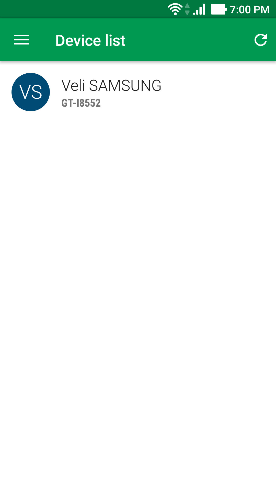
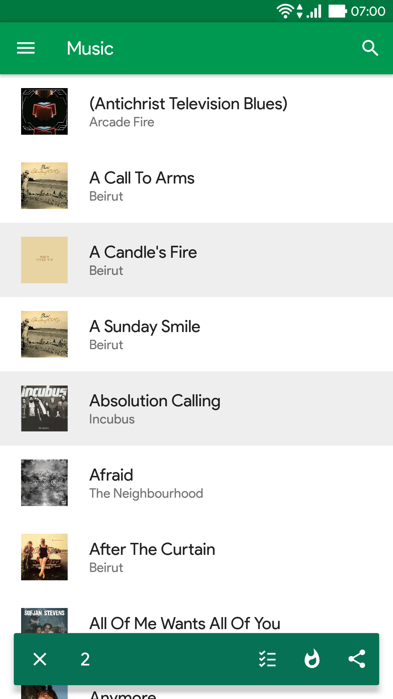
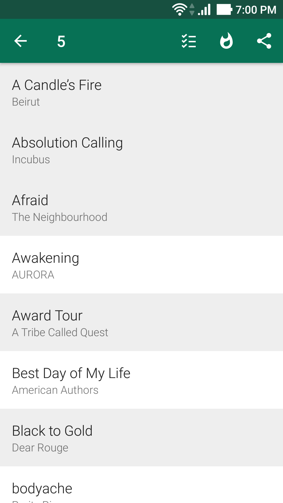
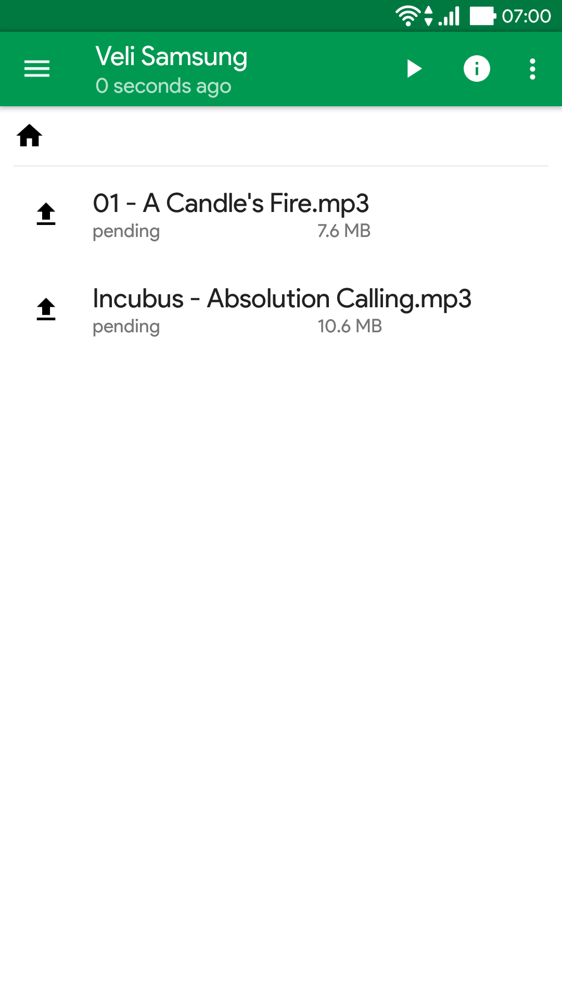
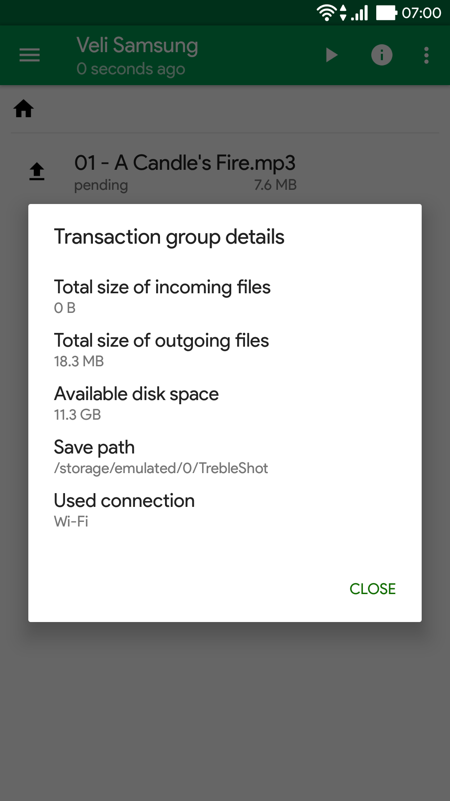
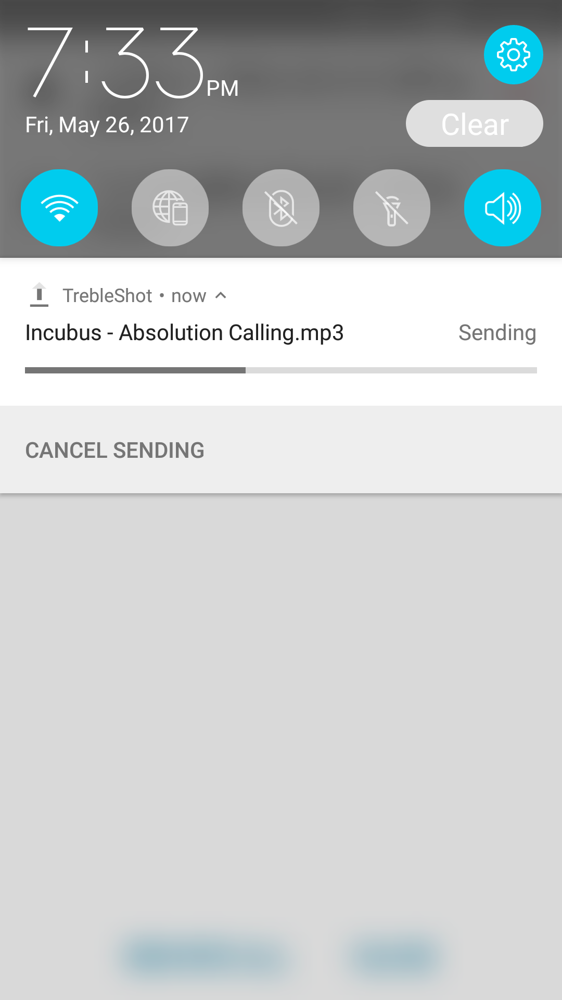
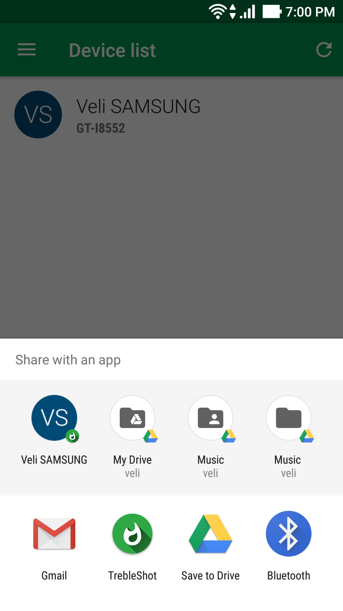
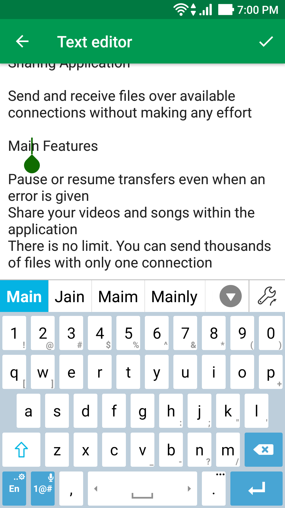
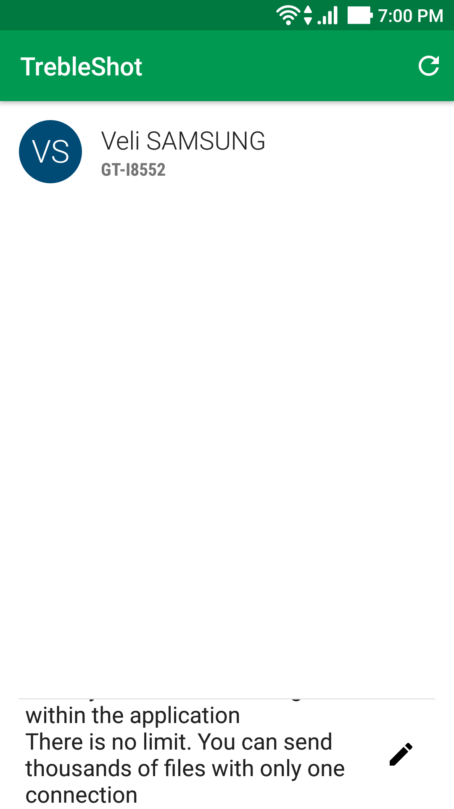

# TrebleShot open-source file and text sharing application
Send and receive files over available connections without making any effort

## Get it from
 

## Main features
* Pause or resume transfers even when an error is given
* Share your videos and songs within the application
* There is no limit. You can send thousands of files with only one connection
* You have the updates installed on your phone but your friend doesn't? Send them using TrebleShot
* You need to send some text information? Just use TrebleShot to do it

## Screenshots

## Project status

## Supported languages
* English
* Turkish

See the development process: https://trello.com/b/YmbwDHHo

This application is licenced under GPL-2.0 and uses some components licenced under Apache License, Version 2.0
